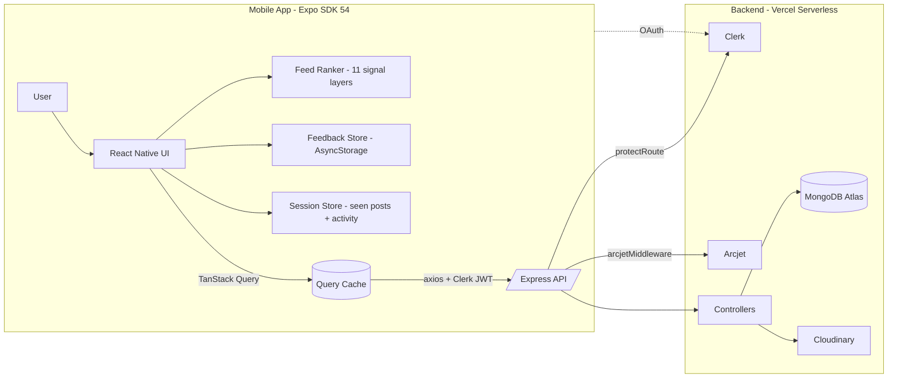

<div align="center">

  

  <h1>xMind — open-source Twitter / Facebook-class social app, built with React Native + Expo SDK 54</h1>

  <p>
    Short-form social network with a hybrid on-device feed ranker, real-time-feeling feed, hashtags, profiles, follows, notifications, and messages — engineered to feel as fast as the originals on a 2&nbsp;GB-RAM Android device.
  </p>

  <p>
    <a href="https://github.com/aashir-athar/xmind-app/stargazers"></a>
    <a href="https://github.com/aashir-athar/xmind-app/network/members"></a>
    <a href="https://github.com/aashir-athar/xmind-app/issues"></a>
    <a href="https://github.com/aashir-athar/xmind-app/blob/main/LICENSE"></a>
    <a href="https://github.com/aashir-athar/xmind-app/commits/main"></a>
    <br />
    
    
    
    
    
  </p>

</div>

> A complete, open-source social-media app you can clone, ship, and learn from. xMind pairs a 120 fps mobile UI built on Expo SDK 54, React Native 0.81, NativeWind 4, FlashList, and Reanimated v4 with a serverless Express + MongoDB Atlas backend on Vercel — guarded by Clerk auth, Cloudinary media, and Arcjet rate-limit shields. Includes a layered on-device feed ranker (TF-IDF, MMR diversity, time-zone-aware decay), a 2026 design-token system, dark/light theming, and platform-aware Liquid Glass / Blur / flat surfaces.

---

## Table of Contents

- [Why xMind?](#why-xmind)
- [Built For](#built-for)
- [Features](#features)
- [Tech Stack](#tech-stack)
- [Architecture](#architecture)
- [The Feed Ranker](#the-feed-ranker)
- [Design Philosophy](#design-philosophy)
- [Getting Started](#getting-started)
- [Scripts](#scripts)
- [Roadmap](#roadmap)
- [Contributing](#contributing)
- [Contributors](#contributors)
- [Star History](#star-history)
- [FAQ](#faq)
- [Acknowledgments](#acknowledgments)
- [License](#license)

---

## Why xMind?

Most "Twitter clone" repos stop at a basic feed — chronological list, like button, fingers crossed. xMind goes further:

- **A real on-device feed ranker.** Eleven layered signals — hard filters, exposure decay, TF-IDF cosine, normalised engagement velocity, time-zone-aware time decay, second-degree connection strength, sentiment-proxy quality, cold-start, MMR diversity rerank, per-author cap, and a 4:1 chronological blend. All deterministic, all on-device, all unit-testable.
- **A platform-aware design system.** A single `<Surface variant="glass" />` decides per request: Liquid Glass on iOS 26+, BlurView on iOS&nbsp;<&nbsp;26, flat tinted surface on Android. BlurView is forbidden on Android by project policy because it tanks scroll FPS on low-end GPUs.
- **A complete production stack.** Clerk auth, MongoDB Atlas, Cloudinary media, Arcjet bot/rate-limit shield, Vercel serverless deploy, EAS Build for iOS / Android binaries.
- **Performance baked in.** FlashList for every virtualised list. `expo-image` for every image. Reanimated v4 worklets for animations on the UI thread. New Architecture (Fabric / TurboModules) enabled. Targets 120 fps on a 2&nbsp;GB-RAM Android device.

---

## Built For

Developers building a `react native expo sdk 54 starter`, a `mobile-first social network mvp`, a `nativewind tailwind starter`, a `clerk auth react native example`, or a `mongodb cloudinary expo template`. Anyone who wants a production-grade open-source twitter clone they can fork, study, or ship.

---

## Features

- Cursor-paginated feed with optimistic likes and optimistic delete
- Layered hybrid feed ranker (TF-IDF + MMR + chronological blend)
- "Not interested" + "Mute @username" curation, persisted across cold starts
- Trending hashtag rail driven by 24h velocity aggregation (Vercel-cached, 5-minute TTL)
- Hashtag-filtered feed, search across users + posts, "people to follow" suggestions
- Profile with banner, avatar, stats, and a Posts / Replies / Media / Likes sub-nav
- Comments sheet with "Replying to @username" hint and threaded composer
- Same-day grouped notifications ("Alex and 12 others liked your post")
- Mock messages with unread dots and conversation cards
- Verified-author SVG badge, custom char-counter ring on the composer
- Dark / Light / system theme via NativeWind 4 CSS variables
- Pill-shaped tab bar with sliding indicator on the UI thread
- Pull-to-refresh + infinite scroll + viewability tracking
- Clerk-powered Apple + Google sign-in
- Cloudinary image transforms (auto format, auto quality, 1080px cap)
- Arcjet bot detection + rate limit on the backend
- Atomic like-toggle on the backend (`$pull` then `$addToSet`)
- Cached mongoose connection across Vercel cold starts
- Cursor-paginated feed with `commentCount` projected via `$size` (no full comment population)

---

## Tech Stack

| Category | Tool | Why |
|---|---|---|
| Mobile framework | Expo SDK 54, React Native 0.81.5, React 19.1 | Latest stable surface with the New Architecture on by default |
| Navigation | expo-router | File-based routing, typed routes, stack + tabs |
| State / data | TanStack React Query, Zustand | Server state separated from client state |
| Forms / validation | react-hook-form, zod | Performance-first forms with strict typing |
| Styling | NativeWind 4 + Tailwind 3 + design tokens | CSS-variable theming + token contract for screens |
| Lists | @shopify/flash-list | Native cell recycling, smooth on low-end Android |
| Animation | react-native-reanimated v4 + worklets | UI-thread animations |
| Glass / blur | expo-glass-effect, expo-blur | iOS 26 Liquid Glass with platform-correct fallback |
| Images | expo-image | Off-thread decode + cross-cell cache |
| Auth | @clerk/clerk-expo + @clerk/express | Apple / Google one-tap sign-in |
| Backend | Express 5 on Vercel | Serverless, zero-cold-start with cached mongoose |
| Database | MongoDB Atlas + mongoose 8 | Indexed cursor pagination on `{createdAt, _id}` |
| Media | Cloudinary | Auto format / quality, 1080px cap |
| Security | Arcjet | Bot detection + rate limit |
| Icons | @expo/vector-icons + custom SVG | Verified badge is a hand-tuned SVG, not a glyph |

---

## Architecture



```
xMind/
|- Mobile/                   # React Native + Expo app
|   |- app/                  # expo-router routes
|   |   |- (tabs)/           # home, search, notifications, messages, profile
|   |   |- (auth)/           # welcome, sign-in
|   |   |- hashtag-posts.tsx
|   |   |- user-profile.tsx
|   |- components/           # feature + ui primitives
|   |   |- ui/               # Surface, Text, Button, Avatar, VerifiedBadge,
|   |   |                    #  CharCounterRing, Skeleton, EmptyState, Card
|   |   |- PostCard.tsx
|   |   |- PostsList.tsx
|   |   |- PostComposer.tsx
|   |   |- PostMenu.tsx
|   |   |- TrendingRail.tsx
|   |   |- ProfileTabs.tsx
|   |   |- GroupedNotificationCard.tsx
|   |   |- CommentsModal.tsx
|   |   |- ChatModal.tsx + ChatCard.tsx
|   |   |- PillTabBar.tsx
|   |- hooks/                # useFeedRanking, useTrendingHashtags,
|   |                        #  useSearch, useNotifications, usePosts,
|   |                        #  useTheme, useCurrentUser, ...
|   |- stores/               # useSessionStore, useFeedbackStore (Zustand)
|   |- utils/                # feedRanking.ts, tfidf.ts, notificationGrouping.ts,
|   |                        #  formatter.ts, api.ts
|   |- constants/            # tokens.ts (design system)
|   |- types/                # User, Post, Comment, Notification
|   |- global.css            # CSS-variable palette
|   |- tailwind.config.js
|   |- app.json + package.json
|- Backend/                  # Express + Mongo on Vercel
|   |- src/
|   |   |- server.js
|   |   |- config/           # db.js, env.js, cloudinary.js, arcjet.js
|   |   |- controllers/      # post, comment, notification, user
|   |   |- routes/
|   |   |- models/           # post, user, comment, notification
|   |   |- middleware/       # auth, arcjet, upload
|- README.md
|- zero-to-deploy.md
```

---

## The Feed Ranker

The mobile app re-scores each fetched feed page on-device, using eleven layered signals applied in this order:

1. **Hard filters** — muted authors, blocked, max age (48h), low quality, "not interested" posts/authors/hashtags, viewer's own posts.
2. **Exposure decay** — posts seen in the current session keep a 0.4× score multiplier (faded, not removed). Visibility is detected via FlashList `viewabilityConfig` at 60% threshold.
3. **Topical relevance** — TF-IDF cosine similarity between the post's content and the user's interaction profile (likes + own posts). Hashtags weight 3× a regular term. Vocabulary capped at top 500 by document frequency.
4. **Engagement velocity** — engagement / hour, normalised against the author's follower count via `log10(followers + 10)`. Stops viral spikes from drowning everything else.
5. **Time decay** — half-life curve with timezone-aware adjustment: posts in the user's active hours (inferred from session activity) decay slower. Trending bonus for recent posts past an engagement floor.
6. **Connection strength** — direct follow + 2nd-degree (follow-of-follow) + per-author affinity rate from interaction history.
7. **Quality + sentiment** — verified author bonus, length goldilocks, hashtag penalty above 5, all-caps + `!!!` sentiment proxy penalty, clickbait-phrase penalty.
8. **Cold-start fallback** — when the user has fewer than 5 interactions, drop personalisation and rank on `verified + velocity + recency` only.
9. **MMR diversity rerank** — top-100 candidates re-ordered with Maximal Marginal Relevance (lambda = 0.7) using TF-IDF cosine as the diversity penalty. Breaks "ten posts on the same hashtag in a row".
10. **Per-author cap** — at most 2 posts per author after MMR.
11. **Chronological blend** — one chronological filler post for every 4 ranked posts. Even strong personalisation can't fully hide what just happened.

Each signal is a pure function — `topicalRelevance`, `engagementVelocity`, `recency`, `connectionStrength`, `qualityScore` — so they're easy to unit-test in isolation.

---

## Design Philosophy

- **Tokens first.** Every padding, radius, colour, font size, and motion curve flows from `Mobile/constants/tokens.ts` and the matching `tailwind.config.js`. No hex codes, no magic numbers in screens.
- **Platform-aware translucency.** A single `<Surface variant="glass" />` resolves to Liquid Glass / BlurView / flat surface so screens stay clean and Android scroll stays fast.
- **Honest microcopy.** Empty states name the next action. Error states take the blame. Confirmations explain the consequence. No dark patterns — no fake "recommended" badge on the sign-in screen, no engagement nags on the empty inbox.
- **Motion as language, not decoration.** Reanimated worklets drive every interaction (tab indicator, button spring, heart pulse, profile-tab indicator) on the UI thread. Removed long-running `withRepeat` pulses on list rows because ambient motion fatigues users.
- **Curation as agency.** "Not interested" + "Mute @username" feed back into the on-device ranker via a persisted Zustand store. The user shapes their feed; the algorithm cooperates.

---

## Getting Started

### Prerequisites

- Node 20 LTS, npm 10 (or Bun / pnpm — `expo install` is package-manager agnostic)
- iOS: Xcode 15+ on macOS for native builds, or Expo Go for the JS-only path
- Android: Android Studio with API 34+ for native builds, or Expo Go
- Accounts (free tiers are fine): MongoDB Atlas, Clerk, Cloudinary, Arcjet, Vercel

### Clone

```bash
git clone https://github.com/aashir-athar/xmind-app.git
cd xmind-app
```

### Mobile

```bash
cd Mobile
npm install --legacy-peer-deps
cp .env.example .env       # then fill in EXPO_PUBLIC_CLERK_PUBLISHABLE_KEY and EXPO_PUBLIC_API_URL
npx expo start
```

### Backend

```bash
cd Backend
npm install
cp .env.example .env       # then fill MONGO_URI, CLERK_SECRET_KEY, CLOUDINARY_*, ARCJET_KEY
npm run dev
```

For full clone-to-store deployment instructions see [zero-to-deploy.md](./zero-to-deploy.md).

---

## Scripts

### Mobile (`Mobile/package.json`)

| Script | What it does |
|---|---|
| `npm start` | Starts the Metro bundler with Expo dev tools |
| `npm run ios` | Boots an iOS simulator on macOS |
| `npm run android` | Boots an Android emulator |
| `npm run web` | Runs the web target (development only) |
| `npm run lint` | Runs `expo lint` |

### Backend (`Backend/package.json`)

| Script | What it does |
|---|---|
| `npm run dev` | Starts the Express server with `node --watch` |
| `npm start` | Production-mode launch (used by Vercel) |

---

## Roadmap

- [x] Cursor-paginated feed with optimistic interactions
- [x] Layered hybrid feed ranker
- [x] Trending hashtag rail (24h aggregation, 5-minute warm cache)
- [x] "Not interested" + "Mute author" feedback loop
- [x] Same-day grouped notifications
- [x] Profile sub-nav (Posts / Replies / Media / Likes)
- [x] Verified badge as custom SVG
- [ ] Real backend interaction-history table (the ranker currently approximates from cached likes)
- [ ] Real-time updates via SSE or websockets
- [ ] Replies feed under the profile sub-nav
- [ ] DM backend (current messages tab is a mock)
- [ ] Push notifications via expo-notifications
- [ ] Maestro E2E suite

---

## Contributing

xMind welcomes pull requests. **First-time contributors very welcome — we have a `good first issue` label specifically for you.** Pick one, drop a comment, and we'll help you get a PR landed.

- Browse: [`good first issue` on GitHub](https://github.com/aashir-athar/xmind-app/labels/good%20first%20issue)
- Branch naming: `feat/<short-slug>`, `fix/<short-slug>`, `chore/<short-slug>`
- Commit style: [Conventional Commits](https://www.conventionalcommits.org/) (`feat: …`, `fix: …`, `refactor: …`)
- Pull request: target `main`, link the issue, describe the user-facing change in 2-3 sentences

Before opening a PR, please run:

```bash
cd Mobile && npx tsc --noEmit
```

and confirm there are zero TypeScript errors.

---

## Contributors

<a href="https://github.com/aashir-athar/xmind-app/graphs/contributors">
  
</a>

---

## Star History

<a href="https://www.star-history.com/#aashir-athar/xmind-app&Date">
  
</a>

---

## FAQ

<details>
<summary><strong>Why is the feed ranker on-device instead of on the backend?</strong></summary>
<br />
Two reasons. First, every signal in the ranker can be computed from data already in the user's TanStack Query cache, so per-user feed personalisation needs no extra backend table or cron job. Second, on-device ranking gives every screen render the fresh result without a round trip — pulling to refresh re-ranks instantly. The backend stays a clean cursor-paginated source of truth.
</details>

<details>
<summary><strong>How does the trending rail stay fast on Vercel cold starts?</strong></summary>
<br />
The /api/posts/trending controller caches the aggregation in an in-memory Map keyed on `(limit)` with a 5-minute TTL. Vercel reuses warm processes for several minutes, so most requests hit the cache. The first request after a cold start runs the aggregation in ~150ms thanks to the `{createdAt: -1}` index on the Post collection.
</details>

<details>
<summary><strong>Why no BlurView on Android?</strong></summary>
<br />
On most Android GPUs, runtime blur forces software composition for the entire compositor tree underneath. That's fine on a Pixel 8; on a 2 GB-RAM phone it's a 30-FPS frame-pacing disaster. Our `<Surface variant="glass" />` primitive renders a flat tinted surface on Android, BlurView on iOS&nbsp;<&nbsp;26, and Liquid Glass on iOS 26+ — all behind a single API.
</details>

<details>
<summary><strong>Can I use this with my own backend?</strong></summary>
<br />
Yes. Set `EXPO_PUBLIC_API_URL` to your endpoint and match the contract documented in `Mobile/utils/api.ts` (cursor-paginated `/posts`, `/posts/trending`, `/posts/:id/like`, etc.). The mobile app is a faithful client of that contract; nothing else couples it to Vercel + Express.
</details>

<details>
<summary><strong>Does it work on Expo Go or do I need a dev client?</strong></summary>
<br />
Most of the app runs in Expo Go. `expo-glass-effect` requires a dev client because it ships a native module — but it falls back to BlurView automatically on iOS&nbsp;<&nbsp;26 and to a flat surface on Android, so Expo Go renders the right thing without crashing. For final builds, use `eas build`.
</details>

<details>
<summary><strong>What about offline support?</strong></summary>
<br />
React Query persists the feed and profile data in memory for the session. The Feedback store ("not interested", muted authors) is persisted via AsyncStorage and survives cold starts. Full offline-first storage (SQLite or WatermelonDB) is on the roadmap.
</details>

---

## Acknowledgments

- [Expo](https://expo.dev) — the SDK that makes shipping React Native a one-command affair
- [Shopify FlashList](https://shopify.github.io/flash-list/) — the only virtualised list that holds 120 fps on low-end Android
- [Tailwind / NativeWind](https://www.nativewind.dev/) — token-driven styling without runtime overhead
- [TanStack Query](https://tanstack.com/query) — the server-state library every mobile app needs
- [Reanimated](https://docs.swmansion.com/react-native-reanimated/) — UI-thread animations that don't starve the JS thread
- [Clerk](https://clerk.com), [Cloudinary](https://cloudinary.com), [Arcjet](https://arcjet.com), [MongoDB Atlas](https://www.mongodb.com/atlas) — production infrastructure with generous free tiers

---

## License

[MIT](./LICENSE) — use it, fork it, ship it.

---

<div align="center">

  Built by <a href="https://github.com/aashir-athar"><strong>Aashir Athar</strong></a>

  <a href="https://github.com/aashir-athar"></a>
  <a href="https://twitter.com/"></a>
  <a href="https://www.linkedin.com/"></a>

</div>

<!--
  GitHub repo housekeeping reminder for the maintainer:
  - Set the repo "About" blurb to: "Open-source Twitter / Facebook-class social media app built with React Native + Expo SDK 54. Layered on-device feed ranker (TF-IDF + MMR), Clerk auth, MongoDB + Vercel."
  - Add topics: react-native, expo, expo-sdk-54, typescript, mobile-app, social-network, twitter-clone, facebook-clone, nativewind, tailwindcss, flashlist, reanimated, clerk, mongodb, cloudinary, arcjet, vercel, tfidf, mmr, feed-ranking
  - Set the repo Homepage URL to your live demo (or the Vercel backend URL).
-->