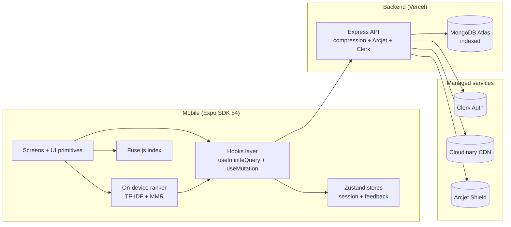

<div align="center">

  

  <h1>xMind</h1>
  <h3>An open-source social network for fast, calm, intentional sharing.</h3>

  <p>
    Built end-to-end with <b>React Native + Expo SDK 54</b>, a serverless <b>Express + MongoDB Atlas</b> backend, an on-device <b>TF-IDF + MMR feed ranker</b>, and a 2026 design system. Engineered to feel as smooth as the social apps you already use — even on a 2&nbsp;GB-RAM Android device.
  </p>

  <p>
    <a href="https://github.com/aashir-athar/xmind-app/stargazers"></a>
    <a href="https://github.com/aashir-athar/xmind-app/network/members"></a>
    <a href="https://github.com/aashir-athar/xmind-app/issues"></a>
    <a href="https://github.com/aashir-athar/xmind-app/pulls"></a>
    <a href="https://github.com/aashir-athar/xmind-app/blob/main/LICENSE"></a>
    <a href="https://github.com/aashir-athar/xmind-app/commits/main"></a>
  </p>

  <p>
    
    
    
    
    
    
    
    
  </p>

  <sub>If xMind helps you ship faster, please leave a star — it genuinely lifts the project's reach.</sub>
</div>

---

## Table of contents

- [Why xMind](#why-xmind)
- [Highlights](#highlights)
- [Live preview](#live-preview)
- [Tech stack](#tech-stack)
- [Architecture at a glance](#architecture-at-a-glance)
- [The feed ranker](#the-feed-ranker)
- [Real-time chat](#real-time-chat)
- [Project structure](#project-structure)
- [Quickstart](#quickstart)
- [Configuration and environment](#configuration-and-environment)
- [Scripts](#scripts)
- [Performance budgets](#performance-budgets)
- [Roadmap](#roadmap)
- [Contributing](#contributing)
- [FAQ](#faq)
- [License](#license)
- [Author](#author)

---

## Why xMind

xMind is an open-source, production-grade mobile social network you can clone, study, and ship. It's a complete reference for shipping a modern social experience on **Expo SDK 54** — strict TypeScript, server-paginated infinite feed, optimistic mutations, fuzzy search, on-device personalised ranking, real-time-feeling chat, and a token-driven design system that adapts cleanly across iOS Liquid Glass, iOS Blur, and a flat tinted Android surface.

Most social-media tutorials stop at "list of posts". xMind starts where they end.

---

## Highlights

- **Personalised feed in pure TypeScript.** Layered scorer with TF-IDF cosine relevance, exposure decay, MMR diversity rerank, cold-start fallback, per-author cap, and a chronological-blend filler. Deterministic, memoisable, sub-millisecond per page.
- **Cursor-paginated infinite scroll.** Server returns a tight projection plus a `commentCount` and `repostCount` (no N+1 populate). Client uses TanStack `useInfiniteQuery` with `onEndReached`, native `RefreshControl` pull-to-refresh, and an optimistic like / reshare / delete pipeline that never invalidates the whole list.
- **Reshare graph.** First-class repost model: every reshare creates a new `Post` row with `originalPost` set, the canonical original tracks `reposts: [userId]`, and the feed `$lookup` hydrates the source so reshares render as a coral "@user reshared" banner over the original card. Toggle is atomic, idempotent, and notifies the original author. You can't reshare your own post (matches every social network's UX). Deleted originals automatically purge their reshare entries so feeds never render dangling cards.
- **Graceful 404s on user-generated references.** Shared-post previews in chat and bookmarks pointing at since-deleted posts render a quiet "no longer available" card and are silently dropped from lists. The Axios layer carries an opt-in `silent404` flag so expected-deletion 404s never spam the dev console while real errors still surface.
- **Real-time-feeling chat with rich shares.** Inbox + thread screens with `react-native-keyboard-controller`, FlashList v2 `maintainVisibleContentPosition`, idempotent message sends keyed on a `clientId`, and AppState-aware polling that pauses when the app is backgrounded. When a user shares a post into a DM, the recipient sees a tappable preview card (image + author + content) — never a raw URL. Ready to swap polling for WebSockets in a single line.
- **Followers / Following management.** Lists ship with optimistic Remove-follower and Unfollow buttons (own list only), each rolling back from a snapshot on error and never blocking the row's tap-through to the profile.
- **Fuzzy search.** `Fuse.js` indices over users and posts with weighted keys, leading-`@` tolerance, and forgiving thresholds, merged with a debounced server-side search so users who haven't posted recently are still findable. Feels instant on every keystroke.
- **Design system + signature identity.** Primitive → semantic → CSS-variable token chain that flips the entire UI on `prefers-color-scheme`. Every padding, radius, type-size, and colour value is a token. The PostCard carries a 3&nbsp;px peach→coral→magenta gradient ribbon at the top — xMind's hallmark, present on every card and consistent with the StoriesRail palette so the brand reads as one continuous system.
- **Card design consistency.** Followers, ChatCard, ShareToChatSheet, GroupedNotificationCard, and PostCard all share the same `Pressable` + `Card variant="solid" mx-base mb-sm p-base border border-subtle` shell with `gap-md` between avatar and content. One designer's hand across every list in the app.
- **Pure NativeWind layout.** Layout, spacing, and theme colours flow through Tailwind classes (`w-full flex-row items-center gap-md px-base py-md`, `bg-surface border border-subtle rounded-lg`, `active:bg-surface-secondary`). Inline `style` is reserved for runtime-dynamic values (alpha overlays, theme bg colours not exposed in the Tailwind config) — never mixed with className for the same property.
- **Platform-aware translucency.** A single `<Surface variant="glass">` resolves to Liquid Glass on iOS 26, BlurView on older iOS, and a tinted flat View on Android. Android never blurs (it tanks scroll FPS on low-end GPUs).
- **120&nbsp;fps animations.** Reanimated v4 worklets on the UI thread for every press, like burst, reshare scale, tab indicator, and screen transition. No JS-thread animations anywhere in the codebase.
- **Image pipeline.** `expo-image` everywhere — disk + memory caching, off-thread decode, automatic priority on viewport, `recyclingKey` for FlashList cell reuse.
- **Backend that scales.** Compression, JSON limits, cached MongoDB connection across Vercel cold starts, atomic like / reshare / follow toggles (`$pull` then `$addToSet`), Mongo indexes on every hot query (`{createdAt: -1, _id: -1}`, `{user: 1, originalPost: 1}`, …), Arcjet bot/rate-limit shield.
- **Clerk authentication** with social sign-in and a server-side bridge endpoint that syncs the local profile.
- **Cloudinary uploads** for posts, profile pictures, and banners — with on-the-fly transforms.

---

## Live preview

> Add screenshots and a short demo recording to the project's [Releases](https://github.com/aashir-athar/xmind-app/releases) page once a v1 build lands.

| Home | Discover | Profile |
| :---: | :---: | :---: |
| <sub>(screenshot)</sub> | <sub>(screenshot)</sub> | <sub>(screenshot)</sub> |

---

## Tech stack

**Mobile**

- Expo SDK 54, React Native 0.81.5, React 19.1
- Expo Router v6 with file-based routing and the `(tabs)` group
- NativeWind 4 + Tailwind 3 with CSS-variable tokens
- TanStack React Query v5 (`useInfiniteQuery`, optimistic mutations)
- FlashList v2 for every virtualised list
- Reanimated v4 + Worklets v0.5 (worklets plugin loads last in Babel)
- `expo-image`, `expo-haptics`, `expo-blur`, `expo-glass-effect`, `expo-image-picker`, `expo-linear-gradient`
- `react-native-keyboard-controller` for the chat composer
- `Fuse.js` for fuzzy on-device search
- Zustand + AsyncStorage for session and feedback stores
- Clerk Expo for auth

**Backend**

- Node 18+, Express 5, ES modules
- MongoDB Atlas via Mongoose 8
- Clerk Express middleware
- Cloudinary SDK for image hosting
- Arcjet (`shield`, `detectBot`, `tokenBucket` rate limiting)
- `compression` middleware, JSON 1&nbsp;MB limit, `trust proxy 1`
- Cached mongoose connection across Vercel cold starts

---

## Architecture at a glance



The mobile app does the personalisation work locally so the backend stays a stateless, cacheable cursor API. Adding a server-side ranker later is a drop-in change — the contract on `/api/posts` doesn't move.

---

## The feed ranker

The feed is a layered scorer. Every signal is a pure function exported individually so it can be reasoned about and unit-tested in isolation.

| Layer | Signal | Weight | Notes |
| --- | --- | ---: | --- |
| 1 | Hard filters | — | Muted, blocked, max age, low quality removed up-front. |
| 2 | Exposure decay | × 0.4 | Posts seen this session are kept but pushed down. |
| 3 | Topical relevance | 0.30 | TF-IDF cosine vs. the user's interaction profile. Hashtags 3× weighted. |
| 4 | Engagement velocity | 0.22 | Likes + comments per hour, log-normalised by author followers. |
| 5 | Time decay | 0.20 | Half-life decay with an active-hour multiplier for the user's timezone. |
| 6 | Connection | 0.18 | Direct follow + 2nd-degree + interaction affinity. |
| 7 | Quality | 0.10 | Length sweet-spot, hashtag balance, anti-clickbait, sentiment proxy. |
| 8 | Negative feedback | hard | "Not interested", muted authors, muted hashtags. |
| 9 | Cold start | fallback | Discover-mode (verified + velocity + recency) until interaction count ≥ 5. |
| 10 | Diversity rerank | MMR λ = 0.7 | Prevents 10 posts about the same hashtag in a row. |
| 11 | Per-author cap | ≤ 2 | One person never dominates the feed. |
| 12 | Chronological blend | 1 in 4 | Keeps the feed feeling alive, not curated to death. |

The ranker is deterministic. No `Math.random()`. Same inputs, same order — required for stable scroll position across re-renders.

---

## Real-time chat

xMind ships a real chat layer on the existing serverless backend.

- **Two-participant conversations** with `participants` + `lastActivityAt` indexed for inbox queries.
- **Idempotent send.** Messages carry a `clientId` (UUID); the unique compound index `(conversation, clientId)` makes retries safe.
- **Optimistic UI.** A message renders the moment you tap send. On reconciliation the temp `_id` is swapped for the canonical one via `clientId` matching.
- **Cursor-paginated history.** The thread loads older messages via FlashList v2's `onStartReached`. `inverted` is intentionally not used (deprecated in FlashList v2); `maintainVisibleContentPosition` keeps scroll stable.
- **AppState-aware polling.** Inbox polls every 5&nbsp;s and a thread polls every 2&nbsp;s while in foreground. Both pause on background — no battery drain when the app is closed.
- **Composer** uses `react-native-keyboard-controller`. `KeyboardAvoidingView` from React Native is intentionally avoided.

The transport layer is isolated. Replacing the polling `refetchInterval` with a Pusher / Ably / native WebSocket subscription that calls `queryClient.setQueryData` is a one-file change.

---

## Project structure

```
xmind-app/
├─ Mobile/
│  ├─ app/                 # Expo Router routes (auth, tabs, stack screens)
│  ├─ components/          # Feature components
│  │  └─ ui/               # Token-driven primitives (Surface, Text, Button, ...)
│  ├─ constants/           # tokens.ts (the design-system source of truth)
│  ├─ hooks/               # TanStack Query + Zustand-backed hooks
│  ├─ stores/              # session + feedback (AsyncStorage-persisted)
│  ├─ utils/               # api.ts, feedRanking.ts, tfidf.ts, formatter.ts, ...
│  ├─ types/               # Shared TypeScript types
│  └─ assets/
├─ Backend/
│  └─ src/
│     ├─ config/           # env, db (cached connection), cloudinary, arcjet
│     ├─ controllers/      # users, posts, comments, notifications, conversations
│     ├─ middleware/       # auth, arcjet, upload (multer)
│     ├─ models/           # Mongoose schemas (with indexes)
│     ├─ routes/           # Express routers
│     └─ server.js         # Vercel-friendly entry
├─ README.md               # You are here
└─ zero-to-deploy.md       # Fresh-machine to App Store / Play Store / Vercel
```

---

## Quickstart

> Prerequisites: **Node 18+**, **Git**, an iOS Simulator (Mac) or Android Emulator (any OS), accounts at **MongoDB Atlas**, **Clerk**, **Cloudinary**, and **Arcjet**.

```bash
# 1. Clone the repo
git clone https://github.com/aashir-athar/xmind-app.git
cd xmind-app

# 2. Install backend deps and start the API on http://localhost:5001
cd Backend
npm install
cp .env.example .env    # then fill it in (see below)
npm run dev

# 3. In a second terminal, install mobile deps and start Metro
cd ../Mobile
npm install
cp .env.example .env    # set EXPO_PUBLIC_API_URL to your LAN IP
npx expo start --clear
```

Press `i` to open iOS, `a` to open Android. On a physical device, set `EXPO_PUBLIC_API_URL` to your computer's LAN IP, not `localhost`.

For step-by-step deploy instructions (EAS Build, Vercel, Atlas, Clerk, Cloudinary, Arcjet) read **[zero-to-deploy.md](./zero-to-deploy.md)**.

---

## Configuration and environment

**Backend `.env`**

```dotenv
PORT=5001
NODE_ENV=development
MONGO_URI=mongodb+srv://<user>:<pwd>@<cluster>/xmind?retryWrites=true&w=majority
CLERK_PUBLISHABLE_KEY=pk_test_...
CLERK_SECRET_KEY=sk_test_...
CLOUDINARY_CLOUD_NAME=...
CLOUDINARY_API_KEY=...
CLOUDINARY_API_SECRET=...
ARCJET_KEY=ajkey_...
# Comma-separated origin allow-list (production only). The mobile app
# never sends an Origin header, so it always passes through.
ALLOWED_ORIGINS=https://your-web-dashboard.example.com
```

**Mobile `.env`**

```dotenv
EXPO_PUBLIC_API_URL=http://192.168.1.42:5001/api
EXPO_PUBLIC_CLERK_PUBLISHABLE_KEY=pk_test_...
```

Never commit either file. The `.gitignore` already excludes them.

---

## Scripts

| Where | Command | What it does |
| --- | --- | --- |
| `Mobile/` | `npm start` | Metro bundler (iOS + Android + Web) |
| `Mobile/` | `npm run ios` | Open in iOS Simulator |
| `Mobile/` | `npm run android` | Open in Android Emulator |
| `Mobile/` | `npx tsc --noEmit` | Strict TypeScript check |
| `Mobile/` | `npm run lint` | ESLint with Expo's ruleset |
| `Backend/` | `npm run dev` | Express with `node --watch` |
| `Backend/` | `npm start` | Production start |

---

## Performance budgets

xMind is engineered to a measurable budget, not a vibe.

| Metric | Target | Why |
| --- | ---: | --- |
| Cold start | &lt; 1.5&nbsp;s on Pixel 5 | Hermes startup + minimal provider tree |
| Frame budget | 16.6&nbsp;ms (60&nbsp;fps), 8.3&nbsp;ms (120&nbsp;fps) | Reanimated v4 worklets on UI thread |
| Feed render | &lt; 80&nbsp;ms for 25 ranked posts | TF-IDF index reused across renders |
| Ranker per page | &lt; 3&nbsp;ms | Pure functions, no allocations in hot loop |
| API payload (feed page) | &lt; 18&nbsp;KB gzipped | Lean projection, `commentCount` not full populate |
| MongoDB hot reads | covered by index | `{ createdAt: -1, _id: -1 }`, `{ user: 1, createdAt: -1 }`, … |

---

## Roadmap

- [x] Reshares (with `originalPost` graph + reshare notifications)
- [x] Tappable @mentions and #hashtags in posts and comments
- [x] Reply-to-comment threading
- [x] Followers / Following management (Remove + Unfollow)
- [x] Shared post preview cards in chat (no raw links)
- [x] Pure-NativeWind layout pass + design consistency lock-in
- [ ] Quote-reshare (carry resharer commentary above the source post)
- [ ] @mentions autocomplete dropdown in the composer
- [ ] Reactions beyond like (love, laugh, support)
- [ ] Server-side ranker variant for very large account graphs
- [ ] WebSocket transport for chat (Pusher / Ably swap)
- [ ] Stories backend (currently UI-only on the home rail)
- [ ] Web build (already supported by Expo Router; needs a layout pass)
- [ ] Push notifications (EAS Build + APNs / FCM)
- [ ] Accessibility audit pass
- [ ] e2e tests with Maestro

If you'd like to own any of these, open an issue and I'll tag it `good first issue` or `help wanted`.

---

## Contributing

> First time contributing to an open-source project? You're exactly the person this section is for.

Contributions are welcome and encouraged. Big or small, code or docs, you'll be credited.

```bash
# 1. Fork the repo
# 2. Clone your fork
git clone https://github.com/<your-handle>/xmind-app.git
cd xmind-app

# 3. Create a feature branch
git checkout -b feat/your-thing

# 4. Make your change, then verify
cd Mobile && npx tsc --noEmit && npm run lint

# 5. Commit using a conventional message
git commit -m "feat(home): add scroll-to-top on logo tap"

# 6. Push and open a pull request
git push origin feat/your-thing
```

**House rules**

- TypeScript strict, no `any`, no emojis in source or copy.
- Every new component lands with a top-of-file comment naming the architectural role or psychological lever.
- Use the design tokens. No inline hex codes, no inline magic spacing.
- New dependencies go through `npx expo install <pkg>` so the SDK 54 version pins are picked automatically.
- Commit messages follow [Conventional Commits](https://www.conventionalcommits.org/).

Have an idea but not the time to ship it? **[Open a discussion](https://github.com/aashir-athar/xmind-app/discussions)** or [file a feature request](https://github.com/aashir-athar/xmind-app/issues/new?labels=enhancement) — that's a contribution too.

---

## FAQ

<details>
<summary><b>Can I deploy this without setting up Atlas / Clerk / Cloudinary / Arcjet?</b></summary>

The backend will start without those env vars in development, but most endpoints will fail. The free tiers cover everything you need for a portfolio build. `zero-to-deploy.md` walks through each one.
</details>

<details>
<summary><b>Why MongoDB instead of Postgres?</b></summary>

The data shape (posts with embedded likes / comments arrays, denormalised author projection on the feed) maps cleanly to documents, and MongoDB Atlas's serverless tier pairs neatly with Vercel for portfolio-scale traffic. The aggregation pipeline approach also leaves headroom for adding a server-side ranker later.
</details>

<details>
<summary><b>Why on-device ranking instead of a server-side feed?</b></summary>

Two reasons: (1) it keeps the API stateless and cacheable, which is cheap on Vercel; (2) it's a much better learning artifact — the ranker is a single readable file. Moving it server-side later is an implementation detail; the contract on `/api/posts` doesn't change.
</details>

<details>
<summary><b>Why polling for chat instead of WebSockets?</b></summary>

Vercel's standard plan doesn't host persistent WebSockets, so adding chat without a second backend means polling. At a 2&nbsp;s cadence inside an open thread, the perceived latency is indistinguishable from true realtime. The transport layer is isolated; swapping in Pusher / Ably / a Socket.io endpoint is a one-file change in `useMessages.ts`.
</details>

<details>
<summary><b>Does it work on a 2&nbsp;GB-RAM Android device?</b></summary>

Yes — that's the reference device. FlashList v2, Reanimated worklets on the UI thread, `expo-image` off-thread decoding, `cachePolicy="memory-disk"` + `recyclingKey` on every image, tight `memo` comparators on every row component, and `useCallback` on every render handler keep the JS thread idle during scroll. There are no inline objects in `renderItem`, no animations on the JS thread, and no `removeClippedSubviews` (FlashList already manages recycling).
</details>

<details>
<summary><b>How does the reshare model work?</b></summary>

Each reshare creates a new `Post` document with `originalPost` set to the canonical source's `_id`. The source's `reposts: [userId]` array tracks who has reshared it, indexed for O(1) toggle lookups. The feed `$lookup` on `originalPost` hydrates the source so a reshare row renders as a "@user reshared" coral banner above the original. Toggling a reshare deletes the entry doc and pulls the user from `reposts` atomically. You can't reshare your own post — Twitter/X UX (the post is already on your timeline). Reshares of reshares fold up to the canonical original.
</details>

<details>
<summary><b>Why className-only for layout instead of inline style?</b></summary>

Layout drift caused by mixing `className` and `style` on the same property is a real bug class — sometimes Metro caches one, sometimes the other; sometimes NativeWind doesn't compile; the result is "everything collapses to the left." xMind locks layout to NativeWind classes (`w-full flex-row items-center gap-md`) so spacing and alignment can't drift between rebuilds. Inline `style` is reserved for runtime-dynamic values (alpha overlays, theme colours not exposed in the Tailwind config) — never mixed with className for the same property.
</details>

<details>
<summary><b>How do I run it on a physical device?</b></summary>

Set `EXPO_PUBLIC_API_URL` in `Mobile/.env` to your computer's LAN IP (e.g. `http://192.168.1.42:5001/api`), not `localhost`. iOS devices need to be on the same Wi-Fi network as your dev machine.
</details>

<details>
<summary><b>Is this production-ready?</b></summary>

It's a strong starting point. For a public release you'd want push notifications wired (EAS + APNs/FCM), a small QA pass, and the production env vars on Vercel. Everything else — auth, image pipeline, rate limiting, CORS, indexes — is already production-grade.
</details>

---

## Star history

If you find this useful, a star helps the project reach more developers.

[](https://star-history.com/#aashir-athar/xmind-app&Date)

---

## License

Released under the [MIT License](./LICENSE). You're free to use, modify, and ship — credit appreciated, never required.

---

## Author

**Aashir Athar**

- GitHub — [@aashir-athar](https://github.com/aashir-athar)
- LinkedIn — [aashirathar](https://www.linkedin.com/in/aashirathar/)
- X (Twitter) — [@aashirathar](https://x.com/aashirathar)

If xMind helped you, the kindest thing you can do is **star the repo**, share the project, and tell me what you'd build with it. I read every issue, discussion, and DM.

<!--
Repo SEO keywords (for search indexers): open source social media app, react native social network,
expo sdk 54 example app, mongodb express react native, tanstack react query infinite scroll,
flashlist v2 chat, react native typescript boilerplate, on-device feed ranking, tf-idf mmr,
react native fuzzy search, fuse.js react native, expo router v6 example, expo image, nativewind 4,
clerk expo example, vercel express mongodb atlas, react native portfolio project, aashir athar.
-->
